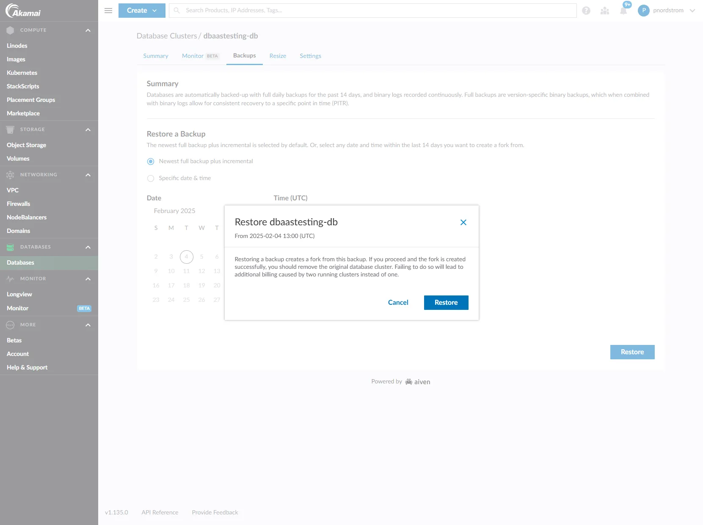

> The full article and link to the series related to this can be found here:  [https://patnordstrom.medium.com/testing-operational-features-of-akamai-managed-databases-part-2-db-restoration-capabilities-9560cf0b9217](https://patnordstrom.medium.com/testing-operational-features-of-akamai-managed-databases-part-2-db-restoration-capabilities-9560cf0b9217)
> 

# Restore DB using *Newest full backup plus incremental* option in Cloud Manager

The image below shows how to initiate this from Cloud Manager

## Notes and Expected Results

- When you click “Restore” this initiates the creation of a new DB
- The name of the new DB will have the convention `{original DB Name} + {datetime of restore}`.  Example:
    - Original DB name is `dbaastesting-db`
    - Restored DB name is `dbaastesting-db-2025-02-04T19-22-11` (in this case this would indicate I initiated the restore on 02-Feb-2025 @ 19:22:11)
- The process of restoring can take up to 15 minutes depending on whether you have a single or multi-node cluster
- Once the DB is restored you can query it and see that the most recent record should match up to the timestamp that you restored from