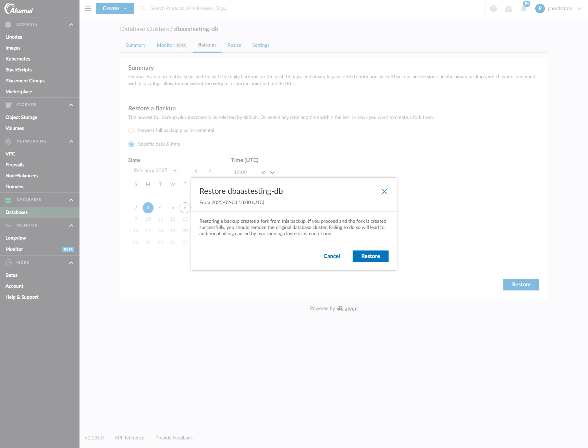
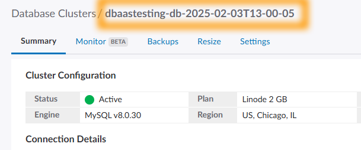

> The full article and link to the series related to this can be found here:  [https://patnordstrom.medium.com/](https://patnordstrom.medium.com/)
> 

# Restoring DB from *Specific date & time option* in Cloud Manager

This image shows an example of selecting a specific date and time in the past to restore from.  The UI (as of this writing) gives you top-of-the-hour precision.  For more specific date and time precision you can use the API which is covered via the script `3-restore-specific-datetime-api.sh` within this repo.

## Notes and Expected Results

- When you click “Restore” this initiates the creation of a new DB
- The name of the new DB will have the convention `{original DB Name} + {datetime of restore}`.  Example:
    - Original DB name is `dbaastesting-db`
    - Restored DB name in this example is `dbaastesting-db-2025-02-03T13-00-05` (in this case this would indicate the latest record would be before this timestamp)
        
        
        
- The process of restoring can take up to 15 minutes depending on whether you have a single or multi-node cluster
- Once the DB is restored you can query it and see that the most recent record should match up to the timestamp that you restored from